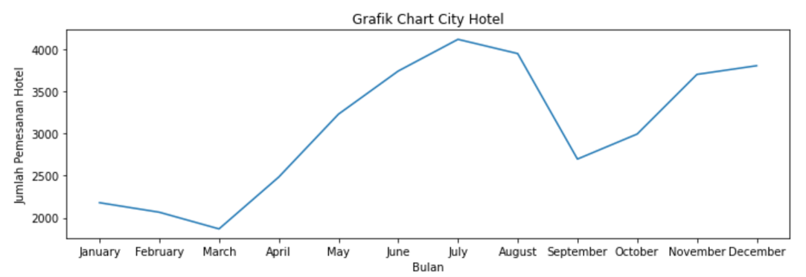
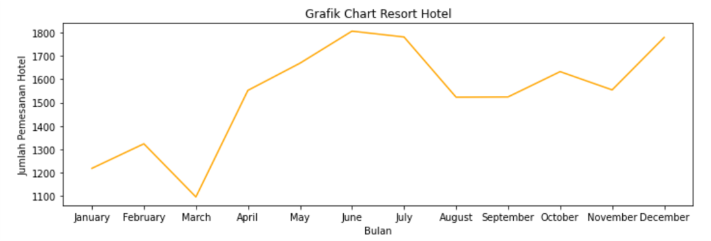

# Investigate Hotel Business using Data Visualization
## Stage 1: Dataset and Data Preprocessing
### Dataset

  Tabel 1. About Dataset  
<kdb></kbd>

### Data Preprocessing
**Missing Values Handling:**
- Due to missing values in 'company' column is very large (more than 90%), then 'company' column will be removed
- Missing values in 'agent' column will be replaced with 0 (indicates as non-agent)
- Missing values in 'city' column will be replaced with 'No City'.
- Missing values in 'children' column will be replaced with 0, the modus of that column

**Unreasonable Values Handling:**
There are several categorical column that have 'Undefined' values. This values will confused the machine learning. Therefore:
- The 'meal' column can't be deleted since the values is to large. So, the undefined values would be replaced with 'No Meal'.
- The'distribution_channel' and 'market_segment' columns just have a very few undefined values. So, they can be excluded. 

## Stage 2: Data Visualization
For this section, we would want to know the correlation of months in year with increasing and decreasing the amount of hotel customer. The result for this section is graph which contains the content of the relationship between the number of customers and time.

### Insight for **City Hotel**:

<kbd></kbd> 
Figure 1. Graph of the number of customers City Hotel against time

Due to Figure 1, interpretation that can be obtained:
- During that period, there was a significant increase in hotel bookings from **March to July**. The hotel experienced an average **increase of around 120%**. This is believed to be due to the **Ramadhan month** falling within that period.
- During **March to July**, the amount of orders **decreased gradually up to 14%**
- In July - September, the number of bookings decreased by 34%. The hotel experienced an increase again during the period from September to December, which was around 41%. This is expected because of the Christmas and New Year holidays.

### Insight for **Resort Hotel**:

<kbd></kbd> 
Figure 2. Graph of the number of customers Resort Hotel against time

Due to Figure 2, interpretation that can be obtained:
- During that period, there was a significant increase in hotel bookings from **March to June**. The hotel experienced an average **increase of around 64%**. This is believed to be due to the **Ramadhan month** falling within that period.
- In **January to March**, the amount of hotel orders gradually **decreased by 10%**.
- During **June to August**, the amount of orders **decreased by 16%** and back **increasing during August - December up to 17%**.

### Insight Recommendation
Hotel's customer traffic increases during certain months due to major holidays such as Christmas and Ramadan. During these periods, school children are also on vacation, leading to many people wanting to enjoy their holidays and vacation with their families. Therefore, some recommendations that hotels can provide: 
- **Offer promotions and discounts** themed around major holidays such as Christmas and Ramadan to target customers who want to vacation during those months.
- **Use targeted advertising techniques**, such as machine learning classification based on data from previous years, to identify which customers have a high potential for booking hotels during holiday seasons.

## Stage 3: Impact Duration to Cancellation
